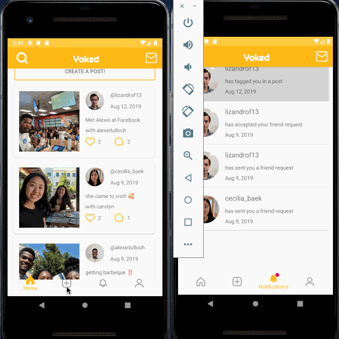

# FBU Team Project - *Yoked*

**Yoked** is a social media app that matches users with their friends who are free at the same times as them and then allows them to share their experiences through posts.

Time spent: **5** weeks spent in total

## User Stories

### Team Roles
**Cecilia: User Profiles, Posts, Newsfeed, and Notification**

**Lizandro: User Calendar and Matching**

**Alexei: User Messaging**

The following **required** functionality is completed:

- [X] User can login/signup
- [X] User can search for other users
- [X] User can friend other users
- [X] User can input their weekly schedule
- [X] Users' schedules can be matched
- [X] User can send messages to other users
- [ ] User receives push notifications

The following **additional** features are implemented:

- [ ] User can save template of their week
- [ ] User can import Google calendar
- [X] User can post to a profile
- [X] User can like posts
- [X] User can comment on posts
- [X] User can tag friends in posts
- [X] User can access camera from app
- [X] User can access gallery from app
- [X] User can view a news feed
- [X] News feed is filtered by friends
- [X] User can see tagged/posted pictures on their profile
- [ ] User sees recommended users
- [ ] User can import contacts
- [ ] User can set location/ allow app access to location
- [ ] User can favorite activities
- [ ] User receives recommended activities
- [ ] User can input their interests
- [X] User can tag friends
- [ ] User can set close friends (higher priority)
- [ ] User can subscribe to a friend group
- [X] Request to hangout button
- [ ] User time/distance/activity preference 

## Video Walkthrough

Here's a walkthrough of implemented user stories:

GIF created with [LiceCap](http://www.cockos.com/licecap/).

## Credits

List an 3rd party libraries, icons, graphics, or other assets you used in your app.

- [Android Async Http Client](http://loopj.com/android-async-http/) - networking library

## License

    Copyright 2019 Cecilia Baek, Lizandro Fernando, Alexei Tulloch

    Licensed under the Apache License, Version 2.0 (the "License");
    you may not use this file except in compliance with the License.
    You may obtain a copy of the License at

        http://www.apache.org/licenses/LICENSE-2.0

    Unless required by applicable law or agreed to in writing, software
    distributed under the License is distributed on an "AS IS" BASIS,
    WITHOUT WARRANTIES OR CONDITIONS OF ANY KIND, either express or implied.
    See the License for the specific language governing permissions and
    limitations under the License.

